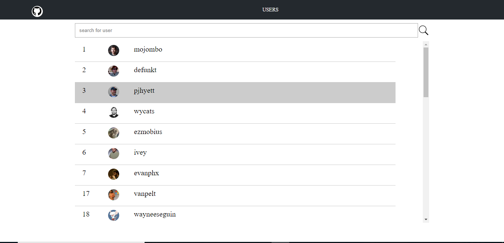

# Githubusers

This project was generated with [Angular CLI](https://github.com/angular/angular-cli) version 8.1.2.

## Development server

Run `ng serve` for a dev server. Navigate to `http://localhost:4200/`. The app will automatically reload if you change any of the source files.

## Code scaffolding

Run `ng generate component component-name` to generate a new component. You can also use `ng generate directive|pipe|service|class|guard|interface|enum|module`.

## Build

Run `ng build` to build the project. The build artifacts will be stored in the `dist/` directory. Use the `--prod` flag for a production build.

# ScreenShots

## Landing Screen

On init of this screen users list will be fetched from github api from the link <a>https://api.github.com/users</a>.

## Search option

On selection of user, repositories List for the selected user will be fetched using the url specified in 'repos_url' tag in user List. Then page will be redirected to repositories screen.

## Repositories Screen

All the repositories fetched for user will be displayed in this screen.

On selection of a repository, link specified in 'html_url' tag in repositories list will be opened in new tab.
